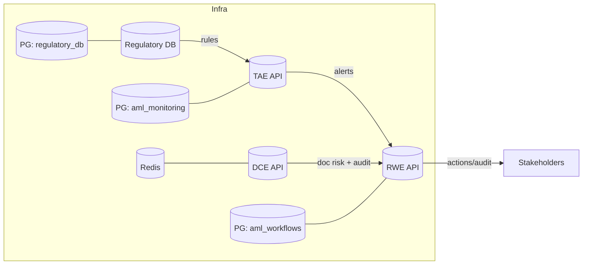
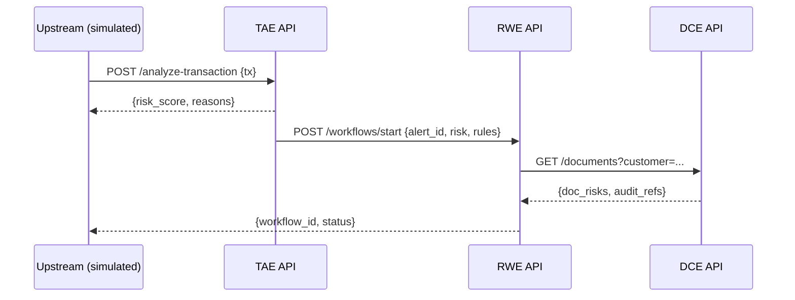

# AML Intelligence Backend — Full Hackathon Deck

## 1) One‑Liner
> Multi‑agent Python microservices for AML: analyze transactions and documents, ingest regulations, and orchestrate remediation with auditable APIs.

## 2) Problem & Goals
- Detect suspicious behavior quickly; explain decisions clearly; keep rules current.
- Automate remediation steps with full audit trails; scale each capability independently.

## 3) Architecture Overview
- Services (Dockerized, API‑first):
  - DCE (8000): Document Corroboration Engine — FastAPI + Celery/Redis + SQLite
  - TAE (8002): Transaction Analysis Engine — FastAPI + Postgres
  - REE (8003): Regulatory Ingestion Engine — FastAPI + Postgres + Alembic
  - RWE (8004): Remediation Workflow Engine — FastAPI + Postgres
- Intelligence: LangGraph multi‑agent orchestration; Groq LLM + Groq Vision; IBM Docling
- Contracts: REST/JSON; health endpoints; per‑service `docker-compose.yml`



## 4) What Each Service Does
- DCE: Validate PDFs/DOCX/Images; OCR/Docling; AI format/content checks; image tamper analysis; risk + audit.
- TAE: Apply static/behavioral/regulatory rules; compute risk; LLM explanations; batch + real‑time.
- REE: Ingest/parse regulatory docs; versioned rules; searchable API for TAE.
- RWE: Multi‑agent remediation workflows; actions, decisions, and immutable audit trail.

## 5) Agents & Frameworks (How It Works)
- Frameworks: FastAPI, LangGraph, Groq SDK (LLM/Vision), IBM Docling, Celery/Redis, SQLAlchemy/Alembic, Pytest, Docker.
- Agent model (LangGraph):
  - State: typed dict/Pydantic shared across nodes.
  - Nodes: pure functions (parse, validate, score, explain).
  - Edges: conditional routing; deterministic first, LLM where it adds value.
  - Observability: per‑node timing, persisted agent logs.
- Typical pipelines:
  - DCE: DocumentProcessor → FormatValidator → [ImageAnalyzer?] → RiskScorer
  - TAE: RuleParser → StaticRules → BehavioralPatterns → RiskScorer → Explainer
  - RWE: Orchestrator → DecisionEngine → ContextEnricher → ActionExecutor → ComplianceChecker

### LangGraph Skeleton (Example)
```python
from langgraph.graph import StateGraph
from typing import TypedDict

class DocState(TypedDict, total=False):
    file_path: str; text: str; structure: dict; image_findings: dict
    risk_score: float; errors: list[str]

g = StateGraph(DocState)

g.add_node("document_processor", document_processor)

g.add_node("format_validator", format_validator)

g.add_node("image_analyzer", image_analyzer)

g.add_node("risk_scorer", risk_scorer)

g.add_edge("document_processor", "format_validator")

def needs_image(state: DocState) -> str:
    return "image_analyzer" if is_image(state["file_path"]) else "risk_scorer"

g.add_conditional_edges("format_validator", needs_image, {
    "image_analyzer": "image_analyzer",
    "risk_scorer": "risk_scorer",
})

workflow = g.compile()
```

## 6) Data Models (Essentials)
- TAE: transactions, risk_assessments, regulatory_rules, agent_execution_logs, audit_trail.
- DCE: documents, audit_trails, processing_templates.
- RWE: workflow_instances, workflow_actions, audit_entries.
- REE: documents, extracted_rules.

## 7) End‑to‑End Flow


## 8) LLM/Vision Strategy
- Ground with structured facts; JSON outputs validated by Pydantic.
- Use LLM for explanations and format/content judgments; keep rule checks deterministic.
- Vision via Groq Vision; structure via IBM Docling; request/response time budgets.

## 9) Performance & Scaling
- Targets: DCE 1k docs/hr; TAE 1k tx/hr; RWE 500 workflows/day.
- Scale per service; monitor queue depth (DCE), DB indices (TAE), step latencies (RWE).

## 10) Security & Compliance
- Never commit `.env`; rotate Groq keys; revoke exposed examples.
- PII minimization and structured audit trails; HTTPS + auth + rate limiting.

## 11) Observability
- `/health` on all services; structured logs with correlation ids.
- Metrics: throughput, latency, error rates, DB/queue health; agent step timing.

## 12) Dev Quickstart
```bash
cd services/<service>
cp .env.example .env  # add GROQ_API_KEY etc.
docker-compose up -d --build
curl http://localhost:<port>/health
# tests
docker-compose exec <service_name> pytest -q
```

## 13) Demo Script (6–8 min)
1) TAE: upload CSV → show `/batch/{id}/status`, `/results`, `/explain/{tx_id}`.
2) DCE: upload `contract.pdf` → show structure, risks, audit trail.
3) RWE: start workflow (risk ≥ 85) → poll `/workflows/{id}` and show audit.
4) REE: open Swagger; show rules powering TAE thresholds.

## 14) Differentiators
- Agents where they matter; deterministic rules for trust/cost.
- Clear boundaries → independent scaling; full auditability; local Docker UX.

## 15) Roadmap
- Streaming ingestion (Kafka/NATS); feature store; sanctions/KYC providers.
- Policy authoring UI; RBAC/tenancy; prod‑grade observability dashboards.

---
Appendix
- Ports: DCE 8000, TAE 8002, REE 8003, RWE 8004
- Repo paths: `services/<service>`, `database/init-all-dbs.sql`
