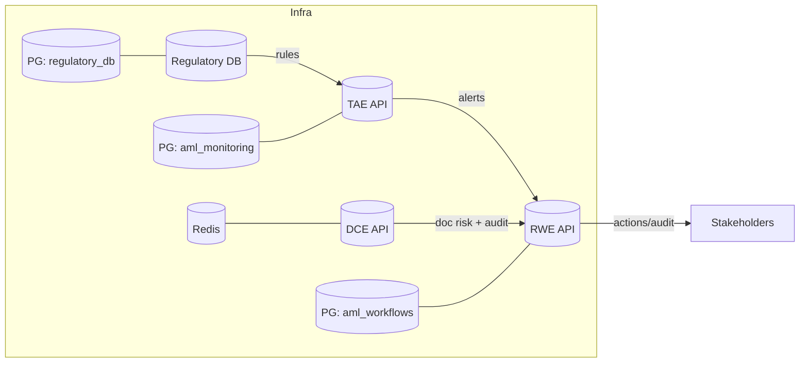
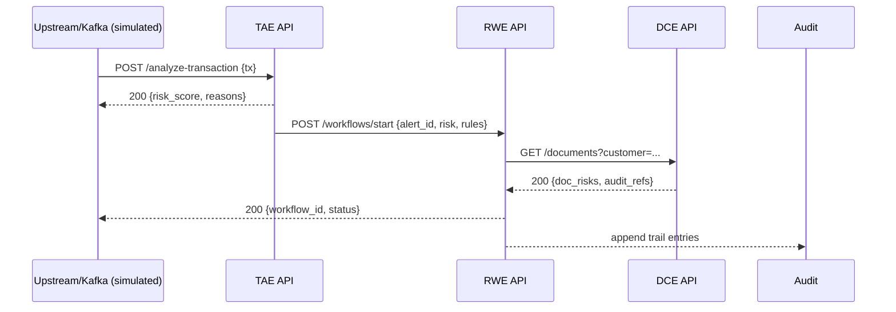

# AML Intelligence Backend — Tech Deep Dive (Hackathon Deck)

## 0) One‑Liner
> Multi‑agent Python microservices that analyze transactions and documents, ingest regulations, and orchestrate remediation — API‑first, auditable, and horizontally scalable.

## 1) System Architecture
- Services (independent, Dockerized):
  - DCE: Document Corroboration Engine (FastAPI + Celery/Redis + SQLite)
  - TAE: Transaction Analysis Engine (FastAPI + Postgres)
  - REE: Regulatory Ingestion Engine (FastAPI + Postgres + Alembic)
  - RWE: Remediation Workflow Engine (FastAPI + Postgres)
- Intelligence: LangGraph multi‑agent orchestration; Groq LLM + Groq Vision; IBM Docling
- Contracts: REST over HTTP; JSON schemas; health endpoints per service



## 2) What Each Service Actually Does
- DCE (8000): Validates PDFs/DOCX/Images; OCR + Docling structure; AI format/content checks; image tamper analysis; consolidated risk score; immutable audit trail.
- TAE (8002): Applies regulatory/static/behavioral rules to transactions; computes risk; produces human‑readable explanations; batch + real‑time endpoints.
- REE (8003): Ingests regulatory documents; extracts/versions rules; searchable API feeding TAE.
- RWE (8004): Runs remediation workflows for high‑risk alerts; multi‑agent decisions; produces audit trail and external actions (emails/docs/tasks).

## 3) Multi‑Agent Designs (LangGraph)
- DCE Agents
  - Document Processor → OCR/Docling; text + structure extraction
  - Format Validator → style/format quality + AI checks (Groq)
  - Image Analyzer → authenticity/tampering (Groq Vision LLaVA)
  - Risk Scorer → weighted aggregation + recommendations
- TAE Agents
  - Rule Parser (LLM‑assisted where needed) → normalize rule set (HKMA/MAS/FINMA)
  - Static Rules → deterministic checks (limits, KYC expiry, sanctions)
  - Behavioral Patterns → heuristics on customer history
  - Risk Scorer → composite score + thresholds
  - Explainer (LLM) → rationale in natural language
- RWE Agents
  - Orchestrator → selects workflow template by severity/PEP/rules
  - Decision Engine → choose next best action set
  - Context Enricher → fetches docs/summaries from DCE/TAE
  - Action Executor → triggers notifications/blocks/doc requests
  - Compliance Checker → verifies regulatory completeness

## 4) Data Models (Essentials)
- TAE (aml_monitoring)
  - transactions(id, ts, amount, src, dst, kyc_age, …)
  - risk_assessments(tx_id, score, level, reasons)
  - regulatory_rules(id, body, clause, threshold, active)
  - agent_execution_logs(step, latency_ms, outcome)
  - audit_trail(event, actor, details, ts)
- DCE (SQLite)
  - documents(id, type, uploader, risk_score, status, meta)
  - audit_trails(ref_id, action, detail, ts)
  - processing_templates(name, weights, checks)
- RWE (aml_workflows)
  - workflow_instances(id, alert_id, status, template)
  - workflow_actions(instance_id, step, state, result)
  - audit_entries(instance_id, actor, event, ts)
- REE (regulatory_db)
  - documents(id, source, version)
  - extracted_rules(id, body, scope, threshold)

## 5) End‑to‑End Flow (Sequence)


## 6) LLM/Vision Usage Strategy
- Prompting: system prompts encode role (parser/explainer/validator); concise contexts; deterministic fallbacks
- Grounding: pass structured facts (rule params, transaction stats, doc structure) to reduce hallucination
- Cost/Latency: use LLM only for explanation/format analysis; rule checks remain deterministic; batch requests where safe
- Vision: Groq Vision for image authenticity; IBM Docling for structured text extraction

## 7) Performance Targets & Concurrency
- DCE: ~1k docs/hr; Celery workers with configurable concurrency; Redis as broker/result backend; backpressure via queue depth
- TAE: ~1k tx/hr; async FastAPI; DB indices on tx timestamp, customer, risk fields
- RWE: 500 workflows/day; idempotent action execution; compensating actions on failure
- P50/P95 budgets: API <100ms/<400ms (non‑LLM); LLM endpoints 1–30s depending on workload

## 8) Security & Compliance
- Secrets in `.env` per service; never commit; rotate Groq keys; revoke any exposed sample keys
- PII minimization: store only necessary fields; redact logs; structured audit trails
- API hardening: auth (JWT/API keys), rate limiting, HTTPS, file size/type checks (DCE)
- DB: least‑privilege, SSL in prod, backups and retention policies

## 9) Observability
- Health: `GET /health` on all services
- Logs: service‑scoped with request ids; agent step timing to `agent_execution_logs`
- Metrics: queue depth (DCE), throughput, latency, error rates; DB connections

## 10) Developer Experience
- Bootstrap
```bash
cd services/<service>
cp .env.example .env  # add GROQ_API_KEY etc.
docker-compose up -d --build
curl http://localhost:<port>/health
```
- Tests
```bash
# In container
docker-compose exec <service_name> pytest -q
# Local
python -m pytest tests/
```
- Useful commands: `docker-compose logs -f <service>`, `docker-compose down -v` (destructive), `lsof -i :<port>`

## 11) Demo Script (6–8 min)
1) TAE: Upload CSV → show `/batch/{id}/status`, `/results`, and `/explain/{tx_id}`
2) DCE: Upload `contract.pdf` → show structure, risks, and audit trail endpoints
3) RWE: Start workflow with `risk_score ≥ 85` → poll `/workflows/{id}` and show audit
4) REE: Open Swagger and show rules exposure powering TAE thresholds

## 12) Differentiators (Why This Build)
- Agent/LLM where it adds value; rules remain deterministic for trust and cost
- Clear service boundaries → independent scaling + faster iteration
- Full auditability across services; regulator‑friendly explanations
- Runs locally with Docker; simple cloud lift‑and‑shift

## 13) Roadmap
- Streaming pipelines (Kafka/NATS) for real‑time ingestion
- Feature store for behavioral signals; drift detection
- Pluggable sanctions/KYC providers; advanced policy authoring UI
- End‑to‑end RBAC + tenant isolation

---

Appendix
- Ports: DCE 8000, TAE 8002, REE 8003, RWE 8004
- DBs: TAE Postgres(5432), REE Postgres(5433), RWE Postgres(8004 svc compose), DCE SQLite
- Health checks: `/health` on all services
- Key repos paths: `services/<service>`, `database/init-all-dbs.sql`
